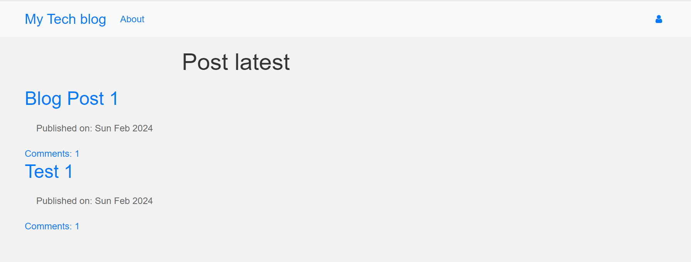

# Blogging Site with Django

This project is a blogging site developed using the Django web framework. It allows users to create, read, update, and delete blog posts. 

## Project Setup

To set up the project, follow these steps:

1. Clone the repository to your local machine.
2. Create a virtual environment for the project.
3. Install the required dependencies by running `pip install -r requirements.txt`.
4. Run database migrations using `python manage.py migrate`.
5. Start the development server with `python manage.py runserver`.

## Project Files

The project consists of the following files:

- `README.md`: This file contains the project documentation.
- `manage.py`: This is the Django management script.
- `requirements.txt`: This file lists the project dependencies.
- Other Django-specific files and directories, such as `settings.py`, `urls.py`, and the app directories.

Feel free to explore the project files and make any necessary modifications to suit your needs.

